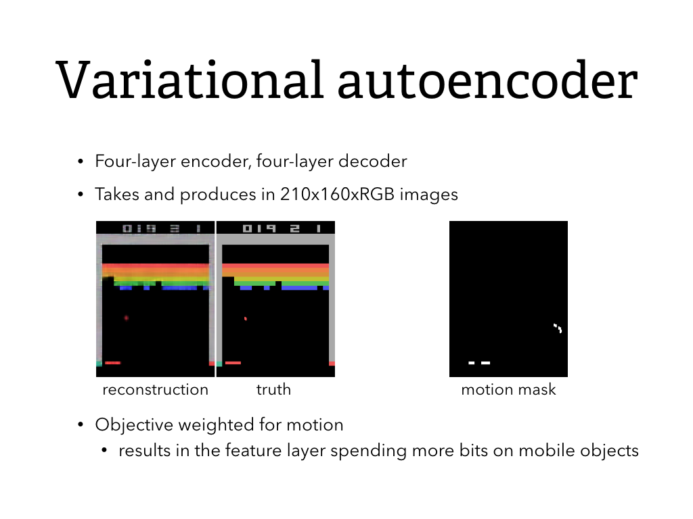
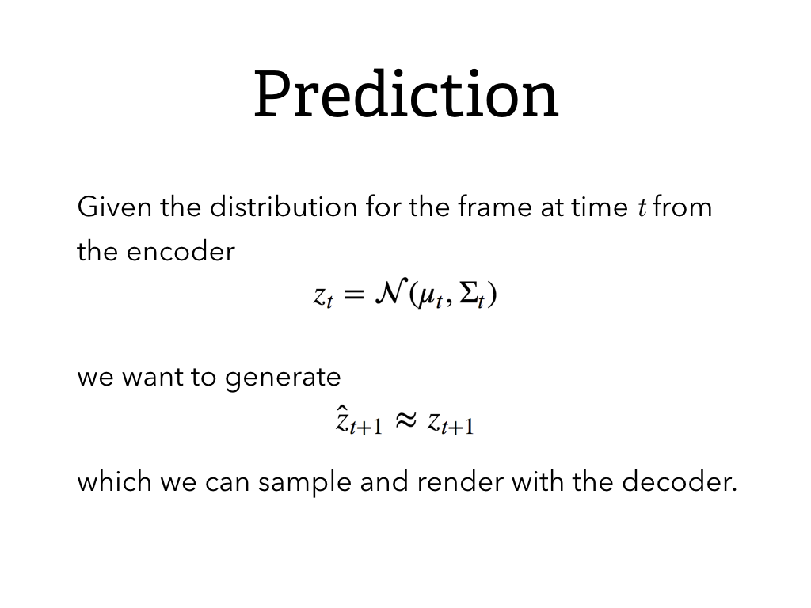
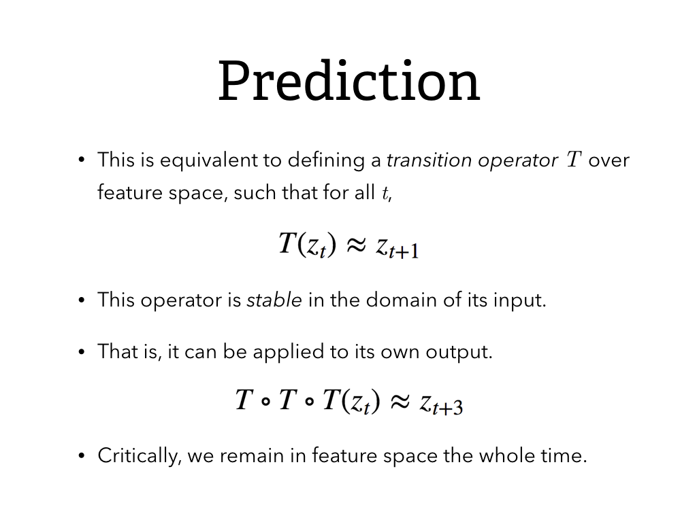

# Deep networks for game prediction

This repo contains the code for a deep neural network which learns to predict the next frame of an Atari game from the previous one or two frames.

## Prediction results

	
	
<b>Prediction using a single frame as input.</b> Note the uncertainty about moving components.

	
	
<b>Prediction using two frames as input.</b> Confidence about the future positions of moving objects greatly improved.

## Model

### Feature extraction with variational autoencoder

The code for the feature extraction is based on my NIPS paper from 2015: [https://github.com/willwhitney/dc-ign](https://github.com/willwhitney/dc-ign) This yields a generative representation of the state.

This diagram is for the DC-IGN; this model does not have the structure show in th hidden representation.

To ensure that even small moving components are captured by the autoencoder, I put a multiplier on the cost function for pixels that change from one frame to the next. This is extremely effective.

### Stable prediction in feature-space

